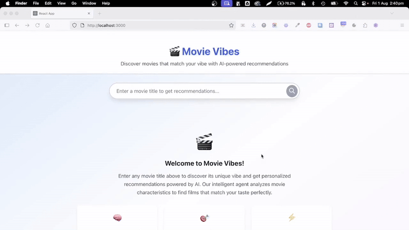

# 🎬 Movie Vibes

[](https://github.com/tyrell/movievibes/actions/workflows/ci.yml)
[](https://github.com/tyrell/movievibes/actions/workflows/package.yml)
[](https://github.com/tyrell/movievibes/actions/workflows/release.yml)
[](https://github.com/tyrell/movievibes/releases)
[](https://openjdk.java.net/)
[](https://spring.io/projects/spring-boot)
[](https://reactjs.org/)
[](LICENSE)

**Movie Vibes** is an AI-powered application that determines the *vibe* of a given movie using metadata and recommends similar movies that share the same emotional or thematic feel. It features a Spring Boot backend with Spring AI and a modern React frontend.

## 🎥 Demo

<div align="center">



*AI-powered movie vibe analysis and recommendations in action*

</div>

## 📊 Project Stats

[](https://github.com/tyrell/movievibes/stargazers)
[](https://github.com/tyrell/movievibes/network/members)
[](https://github.com/tyrell/movievibes/issues)
[](https://github.com/tyrell/movievibes/pulls)
[](https://github.com/tyrell/movievibes/commits/main)
[](https://github.com/tyrell/movievibes)

---

## 🚀 Features

- 🔍 Fetch movie metadata from the OMDb API
- 🧠 Use a local Large Language Model (LLM) via Spring AI to:
  - Determine the **vibe** of a movie
  - Recommend **similar movies**
- 🎨 Modern React + TypeScript frontend with custom CSS
- 📱 Responsive design for all devices
- 🧾 Structured JSON API responses with full movie metadata
- ⚡ Real-time loading states and error handling
- 🎯 2-minute timeout for AI operations
- 🖼️ Movie poster images for main movies and recommendations
- ✅ Ready for production deployment

---

## ⚙️ Movie Data Modes

Movie Vibes supports two distinct modes for fetching movie metadata:

### 🔗 Direct API Mode (Default)
- **Description**: Direct calls to the OMDb API for standard movie metadata
- **Configuration**: `mcp.enabled=false` (default)
- **Requirements**: Only requires OMDb API key
- **Features**: 
  - Standard movie metadata
  - Direct REST API communication
  - Faster response times
  - No additional server dependencies

### 🤖 MCP Mode (Model Context Protocol)
- **Description**: Uses the Model Context Protocol (MCP) server to access OMDb API via standardized protocol
- **Configuration**: `mcp.enabled=true`
- **Requirements**: Requires [OMDB MCP Server](https://github.com/tyrell/omdb-mcp-server) running on port 8081
- **Features**: 
  - Standardized tool-based API access
  - Protocol abstraction layer
  - JSON-RPC 2.0 communication
  - Consistent interface for AI agents
- **Setup**: 
  ```bash
  # Start the MCP server (required for MCP mode)
  git clone https://github.com/tyrell/omdb-mcp-server
  cd omdb-mcp-server
  # Follow MCP server setup instructions
  ```

### 🔄 Mode Configuration

**Environment Variable:**
```bash
# Enable Direct API mode (default)
export MCP_ENABLED=false

# Enable MCP mode for protocol-based API access
export MCP_ENABLED=true
```

**Application Properties:**
```properties
# Direct API Mode Configuration (default)
mcp.enabled=false
omdb.url=https://www.omdbapi.com/
omdb.api-key=${OMDB_API_KEY}

# MCP Mode Configuration (requires MCP server)
mcp.enabled=true
mcp.omdb.base-url=http://localhost:8081
```

The application automatically selects the appropriate client based on configuration. Direct API mode works immediately with just an OMDb API key. Enable MCP mode to use the Model Context Protocol for standardized API access.

---

## 🛠️ Tech Stack

| Layer        | Technology               |
|--------------|---------------------------|
| Frontend     | React 18 + TypeScript    |
| Styling      | Pure CSS (Custom Utilities) |
| Backend      | Spring Boot 3.x           |
| LLM Interface| Spring AI                 |
| HTTP Client  | RestTemplate              |
| Movie Data   | OMDb API + MCP Server     |
| Build Tool   | Maven + npm               |
| Language     | Java 17+ + TypeScript    |
| Deployment   | Docker + Docker Compose   |

---

## 📦 Requirements

### Local Development
- Java 17+
- Maven 3.8+
- Node.js 16+ and npm
- Ollama with llama3 model
- OMDb API key (free: https://www.omdbapi.com/apikey.aspx)
- **Optional**: [OMDB MCP Server](https://github.com/tyrell/omdb-mcp-server) for Model Context Protocol access (MCP mode)

### Docker Deployment
- Docker Desktop (or Docker Engine + Docker Compose)
- OMDb API key
- **Optional**: [OMDB MCP Server](https://github.com/tyrell/omdb-mcp-server) for Model Context Protocol access (MCP mode)

---

## 📁 Repository Structure

```
movievibes/
├── build/                        # Build and deployment configuration
│   ├── docker/                   # Docker files and compose configuration
│   │   ├── Dockerfile            # Main application container
│   │   ├── Dockerfile.ollama     # Custom Ollama image with pre-downloaded models  
│   │   ├── docker-compose.yml    # Complete stack orchestration
│   │   └── .dockerignore         # Docker build context exclusions
│   └── scripts/                  # Build and deployment scripts
│       ├── docker-build-all.sh   # Build both application and Ollama images
│       ├── docker-start.sh       # Start the complete application stack
│       ├── docker-stop.sh        # Stop and cleanup containers
│       └── test-*.sh             # Testing and validation scripts
├── docs/                         # Documentation and guides
├── frontend/                     # React TypeScript frontend
├── src/                          # Spring Boot backend source code
├── docker-*.sh                   # Convenience scripts (delegate to build/scripts/)
├── .env.example                  # Environment variables template
├── pom.xml                       # Maven project configuration
└── README.md                     # Main project documentation
```

### Quick Commands

```bash
# Start the application (builds if needed)
./docker-start.sh

# Build Docker images only
./docker-build.sh

# Stop the application
./docker-stop.sh

# Manual Docker commands
docker compose -f build/docker/docker-compose.yml up -d
docker compose -f build/docker/docker-compose.yml down
```

---

## 🚀 Quick Start with Docker (Recommended)

The easiest way to run Movie Vibes is using Docker. **Both frontend and backend are built and served from a single container with pre-downloaded AI models:**

```bash
# 1. Set your OMDb API key
export OMDB_API_KEY=your_api_key_here

# 2. Start the application (first run: ~10 min build, subsequent: ~30 sec)
./docker-start.sh

# 3. Access the application
Full App (Frontend): http://localhost:8080
API endpoint: http://localhost:8080/api/agent/recommendations?title=Inception
```

That's it! The Docker setup automatically:
- ✅ Builds the React frontend and embeds it in Spring Boot  
- ✅ **Pre-downloads AI models during build for fast startup**
- ✅ Starts Ollama with llama3 model (ready immediately)
- ✅ Configures networking between services
- ✅ Sets up health checks  
- ✅ Serves frontend and API from single port (8080)

� **Performance**: First build ~10 minutes (model download), subsequent starts ~30 seconds!

�📖 **For detailed Docker instructions**, see [DOCKER.md](DOCKER.md) | [Model Setup Guide](docs/docker-model-setup.md)

---

## ⚙️ Environment Setup

**Important**: This application requires API keys that should never be committed to version control.

### Required Environment Variables

1. **Create environment file**:
```bash
cp .env.example .env
```

2. **Get an OMDb API Key**:
   - Visit [OMDb API](http://www.omdbapi.com/apikey.aspx)
   - Sign up for a free API key
   - Add it to your `.env` file:

```bash
# .env
OMDB_API_KEY=your_actual_api_key_here

# Optional: Enable MCP mode for protocol-based access
MCP_ENABLED=true  # Set to true to use MCP server (requires setup below)
MCP_OMDB_BASE_URL=http://localhost:8081  # MCP server URL
```

3. **Optional: Setup MCP Server** (for Model Context Protocol access):
   ```bash
   # Clone and setup the MCP server (only if you want protocol-based API access)
   git clone https://github.com/tyrell/omdb-mcp-server
   cd omdb-mcp-server
   # Follow the MCP server README for installation and startup
   # The MCP server should run on port 8081
   # Then set MCP_ENABLED=true in your .env file
   ```

### Docker Environment

For Docker deployment, either:
- Set environment variables in your shell
- Use a `.env` file (automatically loaded by docker-compose)
- Pass variables directly to docker-compose

```bash
# Option 1: Export environment variable
export OMDB_API_KEY=your_actual_api_key_here
docker compose -f build/docker/docker-compose.yml up

# Option 2: Use .env file (recommended)
echo "OMDB_API_KEY=your_actual_api_key_here" > .env
docker compose -f build/docker/docker-compose.yml up
```

---

## 🔧 Manual Setup

### Backend Setup

1. **Start Ollama**

```bash
ollama pull llama3
ollama run llama3
```

2. **Clone the repo**

```bash
git clone https://github.com/tyrell/movievibes.git
cd movievibes
```

3. **Configure API Key and Movie Data Mode**

In `src/main/resources/application.properties`:

```properties
# Spring AI Configuration
spring.ai.ollama.base-url=http://localhost:11434
spring.ai.ollama.model=llama3

# Movie Data Mode Configuration
# Direct API Mode (default - only requires OMDb API key)
mcp.enabled=false
omdb.url=https://www.omdbapi.com/
omdb.api-key=REPLACE_WITH_YOUR_KEY

# MCP Mode (optional - requires MCP server setup)
# mcp.enabled=true
# mcp.omdb.base-url=http://localhost:8081
```

**For Direct API Mode** (Default): Just provide your OMDb API key and you're ready to go!  
**For MCP Mode** (Optional): Set `mcp.enabled=true` and ensure the [OMDB MCP Server](https://github.com/tyrell/omdb-mcp-server) is running on port 8081

4. **Build and run the backend**

```bash
mvn clean install
mvn spring-boot:run
```

The backend will be available at `http://localhost:8080`

### Frontend Setup

1. **Navigate to frontend directory**

```bash
cd frontend
```

2. **Install dependencies**

```bash
npm install
```

3. **Start the development server**

```bash
npm start
```

The frontend will be available at `http://localhost:3000`

---

## 🔗 API Usage

### `GET http://localhost:8080/api/agent/recommendations?title=Mission Impossible`

**Response:**

```json
{
    "movie": {
        "title": "Mission: Impossible",
        "year": "1996",
        "genre": "Action, Adventure, Thriller",
        "plot": "An American agent, under false suspicion of disloyalty...",
        "poster": "https://...",
        "imdbRating": "7.2"
    },
    "vibeAnalysis": "An exhilarating and suspenseful action-adventure...",
    "recommendations": [
        {
            "title": "The Bourne Identity",
            "year": "2002",
            "genre": "Action, Mystery, Thriller",
            ...
        }
    ]
}
```

---

## 🎨 Frontend Features

- **🔍 Movie Search**: Intuitive search interface
- **🎬 Movie Cards**: Beautiful displays with posters and details for main movies and recommendations
- **🧠 Vibe Analysis**: AI-generated mood and theme analysis
- **📱 Responsive Design**: Works on desktop, tablet, and mobile
- **⚡ Real-time Updates**: Live loading states and error handling
- **🎯 Recommendations**: Grid layout of similar movies with full metadata and posters

---

## ✅ Status

✔️ Backend API implemented  
✔️ React frontend with custom CSS design system  
✔️ CORS configuration for frontend-backend communication  
✔️ Responsive design for mobile, tablet, and desktop  
✔️ 2-minute timeout handling for AI operations  
✔️ Automatic API response format transformation  
✔️ Comprehensive error handling and user feedback  
✔️ Movie poster images for main movies and recommendations  
✔️ Full movie metadata fetching from OMDb API  
✔️ Basic test framework with CI integration  
🧪 Comprehensive feature test coverage pending  
🚀 Ready for deployment

---

## 🌟 Future Improvements

- Add caching for OMDb API responses
- Integrate with additional movie databases
- Add user accounts and favorites
- Implement movie ratings and reviews
- Add dark mode theme
- Add comprehensive test coverage
- Enhance MCP server with poster image support

---

## 📄 License

MIT License

---

## ✨ Credits

Built with ❤️ using Spring Boot, Spring AI, React, and Open Movie Database API.

---
